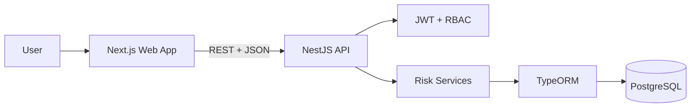
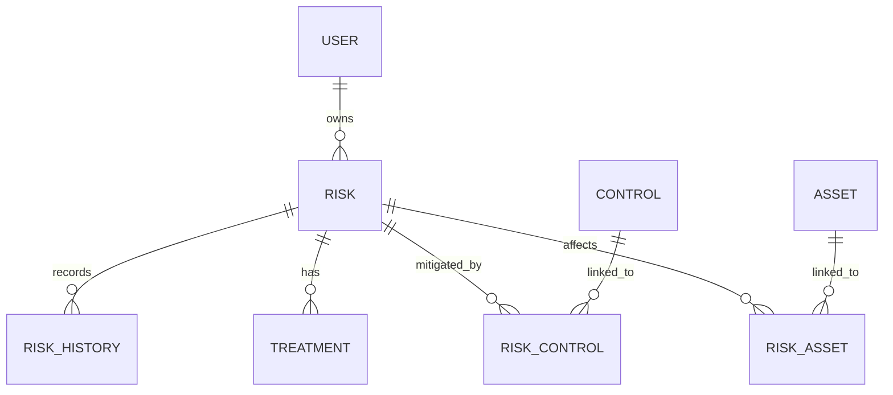

# GRC Risk Register

A full-stack risk-management application for tracking assets, controls, treatments, inherent risk, and residual risk.

## Overview

GRC Risk Register is a compact portfolio application for recording organizational risks and showing how assets, controls, owners, and treatments relate to those risks. It uses a simplified, original scoring model designed for education and demonstration.

## Why This Project Exists

The project demonstrates practical full-stack engineering and GRC domain understanding: relational modeling, authentication, authorization, dashboards, REST APIs, PostgreSQL, Docker, and modern React/Next.js development.

## Features

- JWT login and registration
- Role-based access control for ADMIN, RISK_MANAGER, and VIEWER users
- Asset, control, risk, treatment, and user management
- Inherent and residual risk scoring
- 5x5 inherent risk heatmap
- Dashboard breakdowns and summary metrics
- Risk filtering, pagination, sorting, history, and CSV export

## GRC Concepts Demonstrated

- Asset: something the organization values and wants to protect.
- Risk: the possibility that a threat or event causes harm.
- Control: a safeguard intended to reduce likelihood or impact.
- Risk owner: the person accountable for monitoring the risk.
- Treatment: the chosen approach to managing the risk.
- Inherent risk: risk before considering controls.
- Residual risk: risk remaining after control effectiveness is considered.

## Technology Stack

- Next.js, React, TypeScript, Tailwind CSS, TanStack Query, React Hook Form, Zod, Recharts
- Node.js, NestJS, TypeScript, TypeORM, PostgreSQL, JWT, bcrypt
- Jest, ESLint, Prettier, Docker, Docker Compose

## Architecture



## Data Model



## Risk Scoring Model

Likelihood and impact are scored from 1 to 5.

```text
inherentRisk = likelihood * impact
```

Ratings:

- 1-4 = LOW
- 5-9 = MEDIUM
- 10-14 = HIGH
- 15-19 = VERY_HIGH
- 20-25 = CRITICAL

When controls are linked, the API averages their effectiveness and calculates:

```text
residualRisk = round(inherentRisk * (1 - averageControlEffectiveness / 100))
```

The minimum residual score is 1. If no controls are linked, residual risk equals inherent risk. This is a simplified educational model, not an industry standard.

## Authentication and Authorization

Users authenticate with email and password. Passwords are hashed with bcrypt, JWTs include user id and role, and mutation endpoints are protected by server-side role checks.

## Screenshots

Screenshot placeholders are documented in [docs/SCREENSHOTS.md](docs/SCREENSHOTS.md). Do not add fake screenshots.

## Getting Started

```bash
npm install
cp .env.example .env
docker compose up postgres
npm run migration:run
npm run seed
npm run dev:api
npm run dev:web
```

Web: http://localhost:3000  
API: http://localhost:3001/api/v1  
Swagger: http://localhost:3001/api/docs

## Environment Variables

See `.env.example` for PostgreSQL, JWT, CORS, and frontend API URL settings.

## Running Locally

Run PostgreSQL with Docker, then start both workspaces:

```bash
docker compose up postgres
npm run dev:api
npm run dev:web
```

Run the API and web commands in separate terminals.

## Running with Docker

```bash
docker compose up --build
```

The API container connects to PostgreSQL using the Docker service name `postgres`. The browser-facing web app uses `NEXT_PUBLIC_API_URL=http://localhost:3001/api/v1`.

## Database Migrations

```bash
npm run migration:run
```

## Seed Data

```bash
npm run seed
```

Demo credentials:

```text
admin@example.test / ChangeMe123!
```

## API Documentation

Swagger is exposed at http://localhost:3001/api/docs.

## Testing

```bash
npm run lint
npm run test
npm run build
```

## Project Structure

```text
apps/api  NestJS REST API
apps/web  Next.js frontend
docs      Supporting portfolio documentation
```

## Design Decisions

See [docs/DESIGN_DECISIONS.md](docs/DESIGN_DECISIONS.md).

## Security Considerations

The project implements password hashing, JWT verification, RBAC, validation, Helmet, CORS, safe DTOs, and server-side authorization. No real secrets should be committed.

## What This Project Demonstrates

It shows how a risk-management workflow can be modeled as a clear full-stack application with explainable domain logic and practical engineering tradeoffs.

## Known Limitations

This is not a compliance platform, certification tool, legal tool, or professional risk advisory system. It does not implement multi-tenancy, evidence workflows, notifications, framework mapping, or enterprise security features.

Docker image verification requires Docker Desktop to be running. Dependency audit results may require planned major framework upgrades as the ecosystem changes.

## Future Improvements

- More frontend component tests
- Better reporting views
- Configurable scoring scales
- Database readiness health endpoint

## Disclaimer

This project is an educational portfolio application. Its scoring model, controls, sample risks, and workflows are simplified examples and should not be treated as professional risk, compliance, legal, or security advice.

The project does not reproduce any proprietary GRC platform or confidential employer implementation.

## License

MIT
